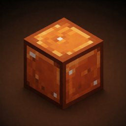
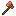
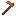
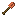
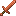
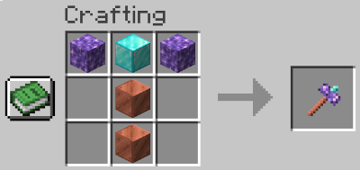
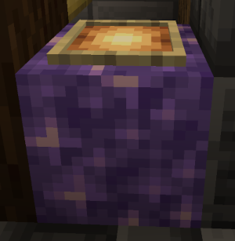

ExpandedItems
=============

Simple Minecraft extension to vanilla, with some expanded
functionality for underutilized materials.

This project provides the following resources:
* Minecraft Java Data and Resource Packs: can be used to play
  in single player as well as hosted on a server with automated
  resource pack downloads.
* Minecraft Bedrock Resrouce Pack and Geyser Mappings JSON: can be added
  to a [GeyserMC](https://geysermc.org/) installation to allow
  Minecraft Bedrock players to join the party as well.

## Features

### Basic Copper Tools

Each of the game iron tools have a Copper based recipe.
The recipe utilizes copper block instead of an iron ingot.

These tools are slightly better versions than the iron ones:
the lore is that you use more minerals compressed and
this gives such tools more durability.

These are designed as handy tools when mining for the first time
looking for Iron, as well as for some building early in the game.

### Reinforced Iron Tools

These are upgrades to the Iron tools utilizing 8 copper blocks around them.
The lore is that you reinforced the tool with copper, giving it extra speed,
durability and dealt damage.

They are designed to be better than Iron but not better than Diamond.

The **Reinforced Iron Sword** is a better than the Iron Sword, as it has more
durability and it is slightly faster to use giving out more damage
than the bare Iron one.

The **Reinforced Iron Pickaxe** has more durability as well, and is faster to mine
than the bare Iron one.

The **Reinforced Iron Hoe** comes already enchanted with Fortune I.

The other tools have no extra features beyond durability.

### New Repair Cost Mechanic

When you have an item that is already on the repair cost limit,
you can fix that by using a special magick Amethyst Table and Hammer.

First, craft an Amethyst Hammer using it recipe in a craft table:

Next, create a special table by placing an Amethyst Block, and on top
of it, a Glow Item Frame, like the picture bellow:

Now the magick happens! Place the item you want to reduce the repair cost
into the glow item frame, and use the hammer on it. Purple particles will
show that the cost has been reset to a usable value of 20, so your next repair
should cost around 21-23 XP. This also allows for more easily enchant your
gear: if the next enchantment is too expensive, you can then do the same
procedure and add another enchantment with a book to your tool.

## Planned features (subject to change)

Whe are planning to introduce some enhanced versions of the tools by
smithing them with a Copper Stick.

Some tools will be hard to craft but rewarding: a multi-use axe that can mine,
and deals decent damage! The Heavy Copper Axe, will be made off a Copper Stick,
and require several Copper Blocks to craft. It lasts
quite some time and since copper is quite abuntant, this will definitelly be
a useful addition to your hotbar.

We are also planning to add some extra tools for the Amethyst item, which increases
drops when used to mine or defeat enemies (it comes enchanted with fortune by default!).
You can also crat an Amethyst Bow, which is strong and endures much more than the wood
counterpart. And to make it even more interesting, there is also a new Amethyst
Trident, which causes more damage.

Some of the ores less used will get some attention. Some special minerals
will be able to be smelted into new material that will be a basis for a new shield,
stronger against some hard to beat mobs.

Warden Horn is a new instrument that will come handy. It drops when you defeat Warden,
and has an extra feature: you can summon a sound wave that will decrease foes speeds.
