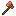
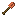

ExpandedItems
=============

Simple Minecraft extension to vanilla, with some expanded
functionality for underutilized materials and some new ones.

This project provides the following resources:
* Minecraft Java Data and Resource Packs: can be used to play
  in single player as well as hosted on a server with automated
  resource pack downloads.
* Minecraft Bedrock Resrouce Pack and Geyser Mappings JSON: can be added
  to a [GeyserMC](https://geysermc.org/) installation to allow
  Minecraft Bedrock players to join the party as well.

## Features

### Copper Tools

Each of the game basic tools have a Copper counterpart.
These are slightly better versions than the stone ones:
they endure more, but can't mine things an iron tool can,
for instance.

These are designed as handy tools when mining for the first time looking for Iron,
as well as for some building early in the game as a more durable alternative for
stone tools.

## Planned features

Whe are planning to introduce some enhanced versions of the tools by
smelting them with a Copper.
For instance, a Copper reinforced Iron Sword, smelted by using a Copper Stick
with a Iron Sword. The resulting tool increases durability and damage.

Some tools will be hard to craft but rewarding: a multi-use axe that can mine,
and deals decent damage! The Heavy Copper Axe, will be made off a Copper Stick
(Stick + Copper Block), and require several Copper Blocks to craft. It lasts
quite some time and since copper is quite abuntant, this will definitelly be
a useful addition to your hotbar.

We are also planning to add some extra tools for the Amethyst item, which increases
drops when used to mine or defeat enemies (it comes enchanted with fortune by default!).
You can also crat an Amethyst Bow, which is strong and endures much more than the wood
counterpart. And to make it even more interesting, there is also a new Amethyst
Trident, which causes more damage.

Some of the ores less used will get some attention. Some special minerals
will be able to be smelted into new material that will be a basis for a new shield,
stronger against some hard to beat mobs.

Warden Horn is a new instrument that will come handy. It drops when you defeat Warden,
and has an extra feature: you can summon a sound wave that will decrease foes speeds.
